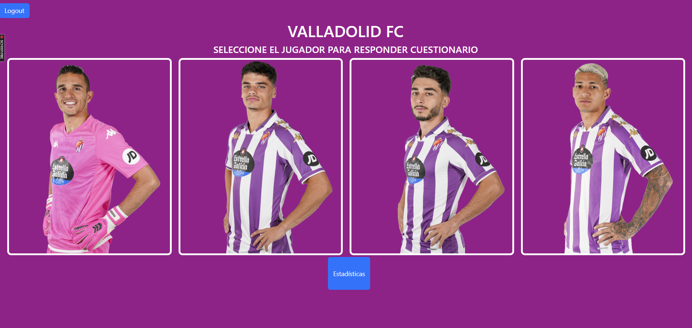
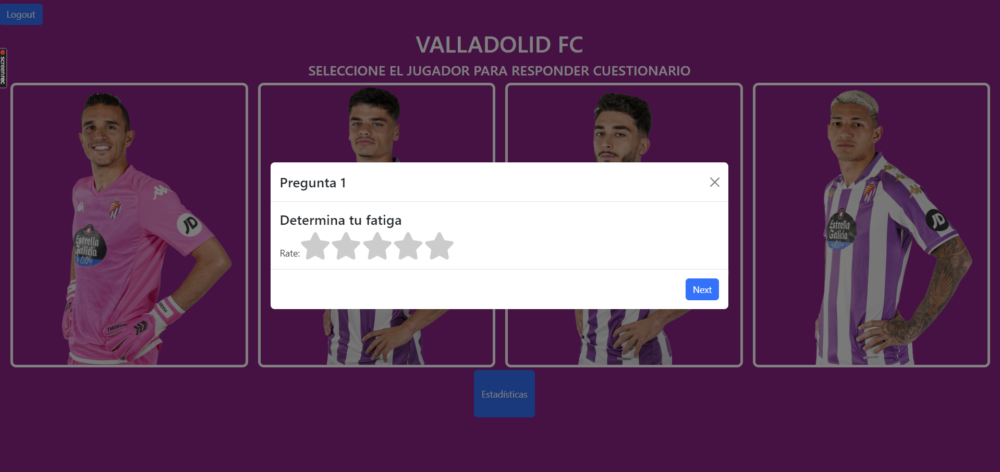
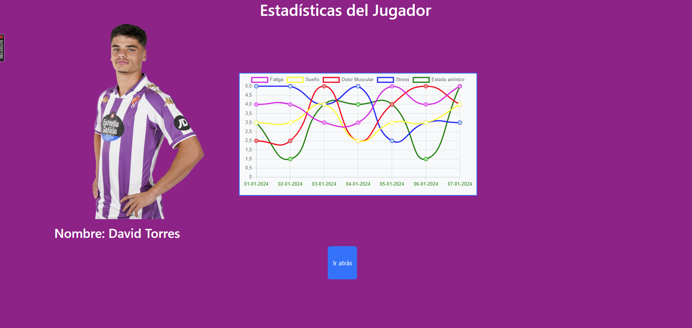
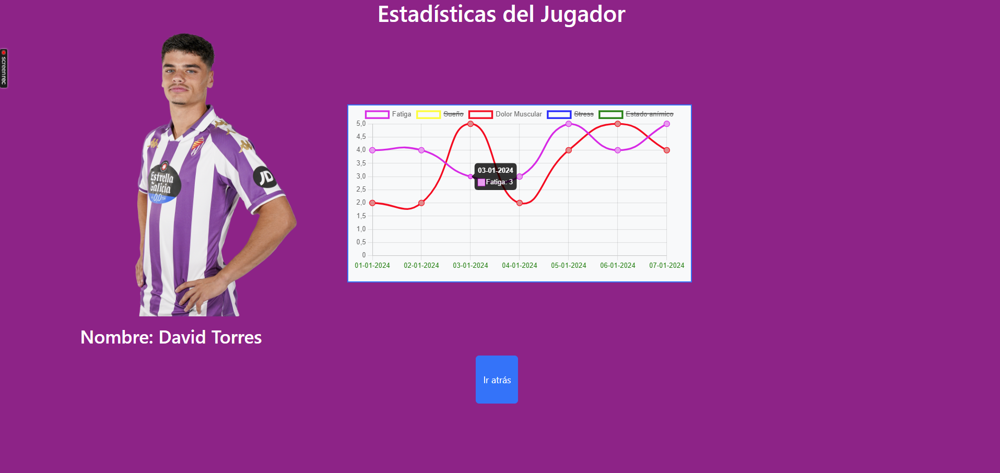

# MERN Valladolid FC Player Stats App

This MERN (MongoDB, Express.js, React, Node.js) project is a web application designed for football players to log in, answer a series of questions, and allow the club to generate statistics based on the responses. The application facilitates the collection and analysis of player data, providing valuable insights for the football club.

## Table of Contents

- [Features](#features)
- [Responsive](#responsive)
- [Tech Stack](#teck-stack)
- [Getting Started](#getting-started)
- [Folder Structure](#folder-structure)
- [Contributing](#contributing)
- [License](#license)

## APP





## Features
- User Authentication: Secure user authentication system to allow football players to log in and access the application.

- Questionnaire Module: A dynamic questionnaire module where players can answer a series of questions related to their performance, fitness, and other relevant aspects.

- Data Visualization: The application provides interactive and visually appealing charts and graphs to help the club interpret and analyze player statistics effectively.

- Player Dashboard: Individualized dashboards for each player, displaying their historical data and performance trends over time.

- Admin Panel: An administrative interface to manage user accounts, view aggregated statistics, and generate reports.


## Responsive Design

This GitHub User Search App is designed to be responsive, ensuring an optimal user experience across different devices and screen sizes. Whether you're using a desktop, tablet, or mobile device, the app adapts to provide a seamless browsing experience.

## Tech Stack
- MongoDB: NoSQL database for storing player data securely.

- Express.js: Backend framework to handle server-side logic and API endpoints.

- React: Frontend library for building a dynamic and responsive user interface.

- Node.js: JavaScript runtime for server-side development.

- JWT Authentication: JSON Web Token-based authentication for secure user access.

- Chart.js: Library for creating interactive charts and graphs.


## Getting Started

Follow these steps to get the project up and running on your local machine.

1. **Clone the repository**:
    ```bash
       git clone https://github.com/franpalberca/prueba-valladolid

Install dependencies:

Navigate to the project directory and install the necessary dependencies.

    cd prueba-valladolid
    npm install

2. **Set up Environment Variable**:

Create a .env file at the root of your project and add all env variables:


3. **Start the development server**:
    ```bash
    npm run dev

4. **Open your browser**:

Open your web browser and visit http://localhost:5173 to see the app.

## Folder Structure
The project's folder structure is organized as follows:
src/: Contains the application's source code, organized into components and styles.
package.json: Contains all the dependencies and dev dependencies.
.env: Environment variable file to store your GitHub personal access token.

## Contributing
Contributions are welcome! Feel free to open issues or pull requests.

## License
This project is free of license and it's use is purely academical.
